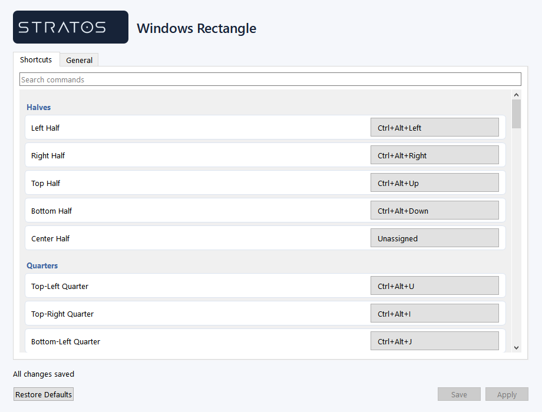

# Windows Rectangle

A Windows 10/11 window manager with configurable global shortcuts, drag snapping,
undo, monitor switching, and saved multi-application workspaces. Implemented in
Python with native Win32 adapters and a PySide6 tray interface.

The repository builds and supports Windows only. Geometry, matching and settings
logic remain independent of the operating system so they can be tested cheaply.

- [User guide and default shortcuts](apps/windows/README.md)
- [Architecture](apps/windows/BRIEF.md)
- [Contributing](CONTRIBUTING.md)
- [Code review and performance evidence](REVIEW.md)



## Development

Source: `apps/windows/windows_rectangle`

Tests: `apps/windows/tests`

Requirements for local development:

- Windows 10 or Windows 11.
- Python 3.11 or newer available as `py` or `python`.
- PowerShell available on PATH.

Run the app locally from the repository root:

```powershell
.\run-windows.bat
```

The launcher creates `.venv` when needed, installs missing dependencies and opens the Preferences window.

Useful local run commands:

```powershell
.\run-windows.bat            # open Preferences and tray app
.\run-windows.bat tray       # start tray-only
.\run-windows.bat stop       # stop existing app instances
.\run-windows.bat test       # run pytest only
.\run-windows.bat check      # run lint, format check, mypy, and tests
```

Manual development commands, if you do not want to use the batch file:

```powershell
py -3.11 -m venv .venv
.\.venv\Scripts\python.exe -m pip install -e ".[win,dev]"
.\.venv\Scripts\python.exe -m windows_rectangle --open-preferences
.\.venv\Scripts\python.exe -m pytest
```

Build a shareable Windows executable with:

```powershell
.\build-windows-exe.bat
```

All generated Windows release files are placed in the `exe` folder inside the
Windows app:

```text
apps/windows/exe
```

The full build command above is equivalent to:

```powershell
powershell -NoProfile -ExecutionPolicy Bypass -File .\scripts\build-windows.ps1
```

For a faster rebuild after dependencies have already been installed:

```powershell
powershell -NoProfile -ExecutionPolicy Bypass -File .\scripts\build-windows.ps1 -NoInstall -SkipChecks
```

The build creates a portable executable folder:

```text
apps/windows/exe/WindowsRectangle.exe
apps/windows/exe/_internal/
apps/windows/exe/WindowsRectangle.exe.sha256
apps/windows/exe/WindowsRectangle-<version>-windows-x64.zip
apps/windows/exe/WindowsRectangle-<version>-windows-x64.zip.sha256
```

The build bundles Python and runtime dependencies, so the user does not need
this repository or a Python environment. Share the zip or the whole
`apps/windows/exe` folder. Keep `WindowsRectangle.exe` beside `_internal`; this
portable layout avoids the PyInstaller one-file extraction path that can produce
`Failed to extract PySide6...` errors on some machines.

To customize the Windows logo, place one of these before running
`.\build-windows-exe.bat`:

App logo for the Preferences UI, in priority order:

```text
logo/windows.ico
logo/logo.ico
logo/app.ico
logo/windows.png
logo/logo.png
logo/app.png
logo/windows.webp
logo/logo.webp
logo/app.webp
```

Tray icon, in priority order:

```text
logo/tray_logo.ico
logo/tray_logo.png
logo/tray_logo.webp
```

The Windows Preferences UI loads the app logo automatically. The tray icon uses
only `tray_logo.ico`, `tray_logo.png`, or `tray_logo.webp`; if none exists, it
uses a transparent blank icon. The build also bundles the `logo` folder into
`apps/windows/exe/_internal/logo`. If you need to override logos after building,
create the relevant files in `apps/windows/exe/logo` next to the executable
folder.

The root `pyproject.toml` points packaging and tests at `apps/windows`, so the
existing Python module name remains `windows_rectangle`.

The Windows Preferences window edits every supported command shortcut and the
general settings. It opens on normal launcher startup and is also available from
the tray menu via `Preferences...`. Use the shortcut search box to filter
commands. Click a shortcut to open the `Record Shortcut` popup, press the
replacement key combo, then click `Apply` or `Save`. Use `Clear` in the popup to
disable that command. Settings are stored in `%APPDATA%\windows_rectangle\config.json`.
The active default shortcut profile is documented in `apps/windows/README.md`.

Run the full Windows quality gate with:

```powershell
.\scripts\check.ps1
```

The root GitHub Actions workflow runs the same gate on `windows-latest`.

## Attribution

Window actions and shortcut conventions are inspired by
[Rectangle by Ryan Hanson](https://github.com/rxhanson/Rectangle).
Required attribution is retained in [THIRD_PARTY_NOTICES.md](THIRD_PARTY_NOTICES.md).
